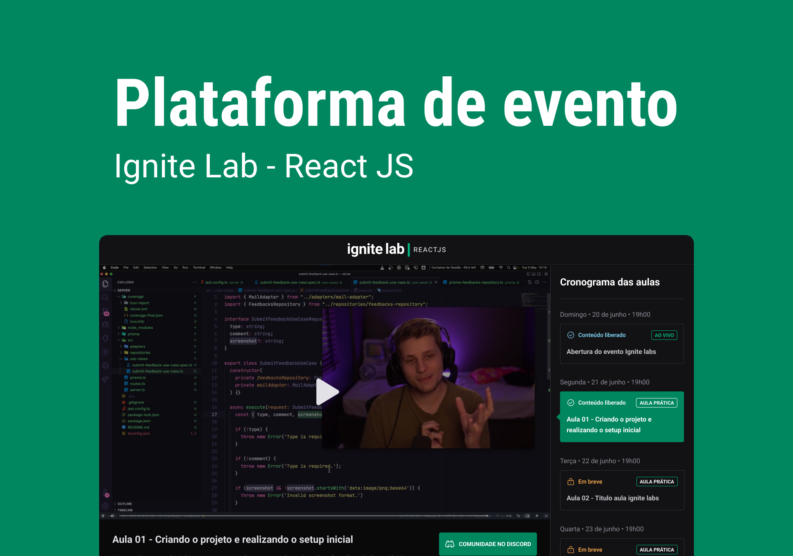

<h1 align="center">Event Platform</h1>

<p align="center">
  <a href="#-setup">Setup</a> •
  <a href="#-technologies">Technologies</a> 
</p>

<p align="center">
  
</p>

## 💻 Setup

**Clone the project and acess the folder**

```bash
git clone https://github.com/je-carlos/Ignite-Lab-React.git && cd Ignite-Lab-React
```

**Follow the steps below**

```bash
# Install the dependencies
$ yarn or npm install

# Run the web server
$ npm run dev

```

## 🚀 Technologies

- [ReactJS](https://reactjs.org/)
- [TypeScript](https://www.typescriptlang.org/)
- [TailwindCSS](https://tailwindcss.com/)
- [GraphCMS](https://graphcms.com/)

---

<p align="center">
  by <a href="https://www.linkedin.com/in/jean-carlos-berg/">Jean Carlos</a>
</p>
